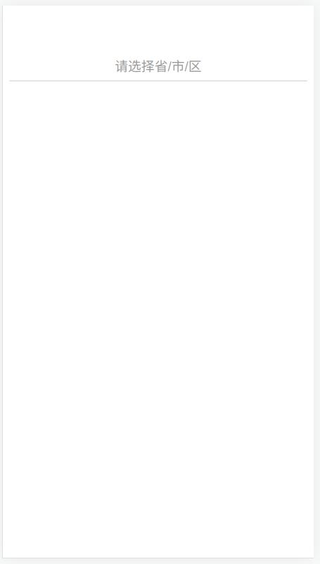
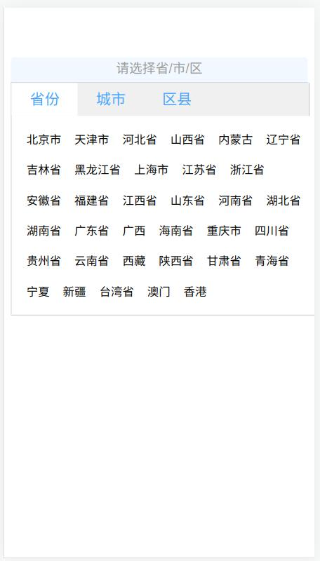
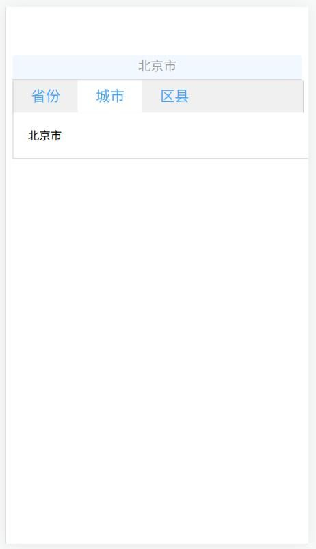
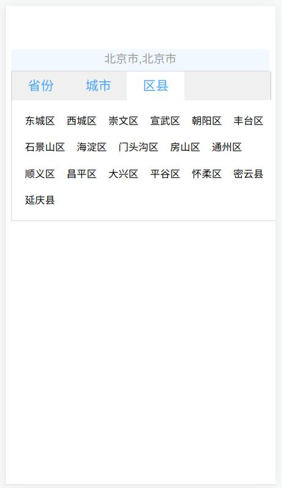
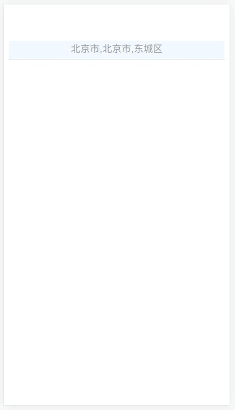

# jquery-cityselect
JQuery-Cityselect By China
该插件来自网络，本项目对其进行模块化，用例见App.vue
## 截图





## Project setup
```
npm install
```

### Compiles and hot-reloads for development
```
npm run serve
```

### Compiles and minifies for production
```
npm run build
```

### Lints and fixes files
```
npm run lint
```

### Customize configuration
See [Configuration Reference](https://cli.vuejs.org/config/).
